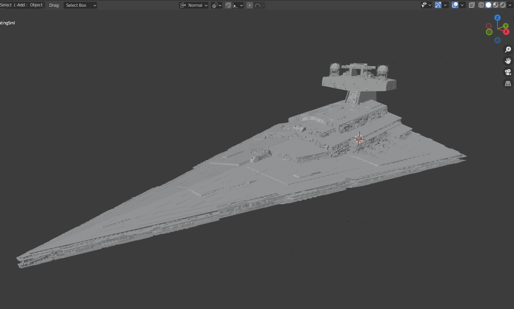

# 3dmc - Convert a 3D model file into your Minecraft world!
A fun project I created in less than a day. I hope you enjoy it!

 

## Demo
### 
In Blender:

### 
In game:

*Watch a demo in `github/demo.mp4`*

## Notes
- Only works in version 1.21.

## Warning
The conversion is multi-threaded but not well optimized.
It will take all your CPU power and a LOT of RAM. A model that's too big could use up all your RAM.

## Configuration
The following options are available in the config.json:
- `scale`: Scale the Minecraft build.
    - Important: a scale that's too high could use up all your RAM and crash your PC.
    - Try something like 0.1 and see how many blocks it generates.
- `rotation`: The rotation to apply to the 3D model.
- `datapacksFolderPath`: The directory of your world datapacks (should be `C:/Users/YOU/AppData/Roaming/.minecraft/saves/YOUR_WORLD/datapacks`)

## How to run
- Put your .stl file in the top-level directory as "input.stl"
- `npm i` - download dependencies
- `npm run build` - build the project
- `npm run start` - run the compiled code
- If you did not set `datapacksFolderPath`, manually place the `3dmc` folder into your datapacks folder.
- Use `/reload` in your world to reload the datapack.
- Use `/function 3dmc:start` and stop moving. The model will be built chunk by chunk at your position.